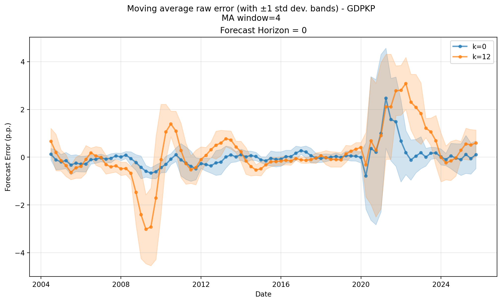
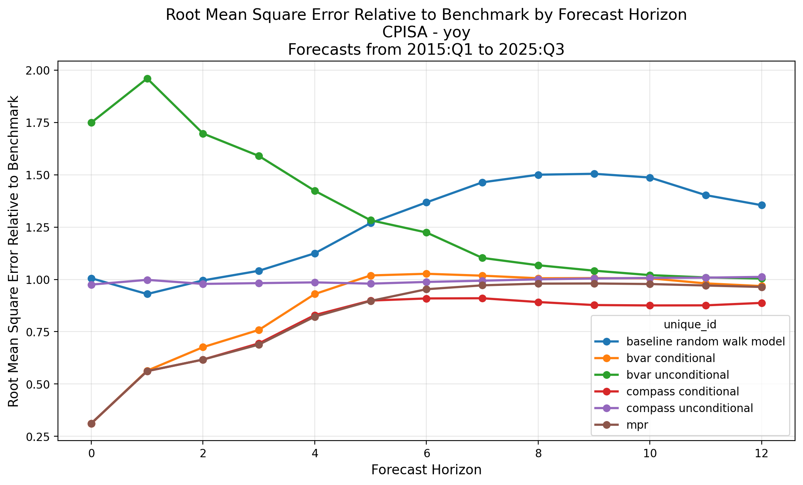
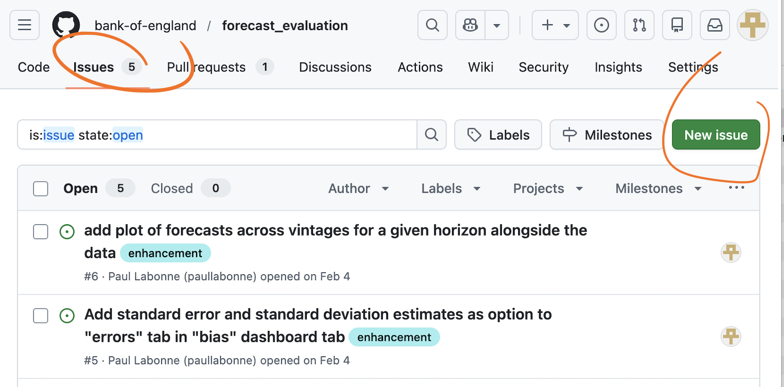

# Learning from Forecast Errors
## Methods and Toolkit
<br>

### Forecasting in central banks, CCBS online seminar
**Paul Labonne**  — Bank of England
<br>

#### Methods based on: [Macro Technical Paper No. 6](https://www.bankofengland.co.uk/macro-technical-paper/2026/learning-from-forecast-errors-the-banks-enhanced-approach-to-forecast-evaluation)

#### Python toolkit: [github.com/bank-of-england/forecast_evaluation](https://github.com/bank-of-england/forecast_evaluation)

#### Demo for this course: [github.com/paullabonne/forecast_eval_teachin](https://github.com/paullabonne/forecast_eval_teachin)

<br>

---

## A little bit about me

- **Paul Labonne** — Senior researcher, Bank of England
- Joined the Bank in 2025 before that at Imperial College, BI in Oslo, King's College London, NIESR.
- Main research interests:
  - *Macroeconomic forecasting* - temporal disaggregation; nowcasting; density forecasts; uncertainty modelling
  - *Scientific modelling* - multimodality with R; Python modelling
- `paul.labonne@bankofengland.co.uk`
---

## Agenda

<style scoped>table { font-size: 20px; }</style>

| # | Topic | |
|---|-------|-|
| 0 | A quick primer on Python | *Packages, classes, instances* |
| 1 | Storing macroeconomic forecasts | *Data format and vintages* |
| 2 | Three dimensions of forecast quality | *Accuracy, bias, efficiency* |
| 3 | Sniff tests | *Visual diagnostics* |
| 4 | Accuracy | *RMSE, MAE, Diebold-Mariano* |
| 5 | Benchmark models | *Random walk, AR(p)* |
| 6 | Bias | *Mean error, Mincer-Zarnowitz* |
| 7 | Efficiency | *Weak (Nordhaus) and strong (Blanchard-Leigh)* |
| 8 | Unstable environments | *Rolling analysis, fluctuation tests* |
| 9 | Dashboard | *Interactive exploration* |
| 10 | **Live demo** | |

---

## A quick primer on Python

**Environment & packages** — Python uses *virtual environments* to keep project dependencies separate. You install packages with `pip`:
```
pip install forecast_evaluation
```

**Importing** — load a package into your script, optionally with a short alias:
```python
import forecast_evaluation as fe   # now use fe.something()
```

**Classes & instances** — a *class* is a blueprint; an *instance* is a concrete copy built from it. `ForecastData` is the blueprint; `data` below is your instance, holding your specific forecasts:
```python
data = fe.ForecastData(your_outturns, your forecasts)  # create an instance
data.forecasts            # attribute: the data it holds
data.add_benchmarks(...)  # method: a function that works only on the instance
```

---

## Storing macroeconomic forecasts

Each row answers: *"What value did source **S** assign to variable **Y** for period **t**, as of vintage **v**?"*

<style scoped>table { font-size: 17px; } table td, table th { padding: 4px 8px; }</style>

| Column | What it means | Examples |
|--------|--------------|---------|
| `variable` | What is being forecast | `cpi`, `gdpkp` |
| `metric` | Transformation applied | `yoy`, `pop`, `levels` |
| `frequency` | Data frequency | `Q`, `M` |
| `date` | *Which period* the value refers to | `2022-03-31` = 2022Q1 |
| `vintage_date` | *When* the number was known | `2021-09-30` = as of 2021Q3 |
| `source` | Who produced it | `AR(p)`, `BVAR`, `SPF` |
| `forecast_horizon` | Periods between vintage and date | `+4` = 4Q ahead; `−k` = revision |
| `value` | The number itself | `0.064` |

---

## Why vintages matter: data revisions



---

## Storing macroeconomic forecasts

`your_forecasts`:
```
        date vintage_date variable  source frequency metric  forecast_horizon   value
  2015-03-31   2015-03-31    cpi   ar(p)         Q    pop                 0  0.0110
  2015-06-30   2015-03-31    cpi   ar(p)         Q    pop                 1  0.0150
  2015-03-31   2015-03-31    cpi    bvar         Q    pop                 0  0.0120
  2015-06-30   2015-03-31    cpi    bvar         Q    pop                 1  0.0160
```

`your_outturns`:
```
        date vintage_date variable frequency metric  forecast_horizon   value
  2015-03-31   2015-06-30    cpi         Q    pop                -1  0.0108
  2015-03-31   2015-09-30    cpi         Q    pop                -2  0.0112
  2015-06-30   2015-09-30    cpi         Q    pop                -1  0.0198
  2015-06-30   2015-12-31    cpi         Q    pop                -2  0.0203
```

```python
import forecast_evaluation as fe

data = fe.ForecastData(
    forecasts_data=your_forecasts,
    outturns_data=your_outturns,
)
```

---

## Three dimensions of forecast quality
<br>

| Dimension | Question | Key methods |
|-----------|----------|-------------|
| **Accuracy** | How close are forecasts to outcomes? | RMSE, MAE, Diebold-Mariano |
| **Bias** | Do forecasts systematically over- or under-predict? | Mean error test, Mincer-Zarnowitz |
| **Efficiency** | Is all available information used optimally? | Nordhaus (weak), Blanchard-Leigh (strong) |

These are **complementary** — a forecast can be accurate on average but still biased or inefficient.

---

## The forecast error

The $h$-quarter-ahead error for variable $y$:
$$\varepsilon(y;k)_{t|t-h} := y_{t|t+1+k} - \hat{y}_{t|t-h}$$

where the outturn vintage $k$ controls which data release is used as the "truth".
We often set $k=12$ (~3 years after the reference quarter).

**Serial correlation at horizons $h > 1$**: even under an optimal forecast, $h$-step-ahead errors follow an MA$(h-1)$ process.

Standard errors in tests must therefore be HAC-robust (e.g. Newey-West with at least $h-1$ lags).

---

## Some sniff tests

- **Hedgehog chart**: overlay all forecast vintages against outturns — reveals persistent over/under-shooting
- **Errors over time**: spot structural breaks, outlier episodes, trending errors
- **Error density**: put individual errors in the context of the full distribution — highlights how unusual recent episodes are

```python
fe.plot_hedgehog(data=data, variable="aweagg",
    forecast_source="mpr", metric="yoy", frequency="Q", k=12)

fe.plot_errors_across_time(data=data, variable="cpisa",
    metric="yoy", horizons=4, sources="mpr", frequency="Q", k=12)

fe.plot_forecast_error_density(data=data, variable="cpisa", horizon=4,
    metric="yoy", frequency="Q", source="mpr", k=12,
    highlight_dates=pd.date_range("2022-01-01", "2024-12-31", freq="QE"))
```

---

## Some sniff tests

  

---

## Accuracy: how large are the errors?

$$\text{RMSE}_h = \sqrt{\frac{1}{N}\sum \varepsilon_{i,h}^2} \qquad \text{MAE}_h = \frac{1}{N}\sum |\varepsilon_{i,h}|$$

Both should monotonically grow with horizon.

- **RMSE** penalises large errors more; sensitive to outliers
- **MAE** treats all errors equally; more robust to outliers

```python
accuracy = fe.compute_accuracy_statistics(data=data, k=12)

accuracy.plot(
    variable="cpisa", metric="yoy",
    frequency="Q", statistic="rmse",
)
```

---

## Accuracy: how large are the errors?


---

## Benchmark models

A **reference point** estimated with real-time vintages.

**Random Walk:** $\hat{y}_{t+h|t} = y_t$

**AR($p$):** $y_t = \mu + \sum_{i=1}^{p} \phi_i y_{t-i} + \varepsilon_t, \quad \varepsilon_t \sim t(\nu, 0, \sigma)$

- Lag order $p \leq 2$ selected by BIC; stationarity enforced
- **Student-$t$ errors** — heavy tails prevent large shocks (2008, 2020) from distorting estimation

```python
data.add_benchmarks(
    models=["AR", "random_walk"],
    metric="pop",
)
```

---

## Benchmark models

 

---

## Relative accuracy: beating the benchmark

$$\text{RMSE ratio}_h = \frac{\text{RMSE}^{\text{model}}_h}{\text{RMSE}^{\text{benchmark}}_h} \quad \begin{cases} < 1 & \text{model wins} \\ > 1 & \text{benchmark wins} \end{cases}$$

The **Diebold-Mariano test** asks if the difference is *significant*.
Define $d_t = \varepsilon^{A\,2}_{t,h} - \varepsilon^{B\,2}_{t,h}$ and test $H_0: \mathbb{E}[d_t] = 0$ with HAC standard errors. Harvey et al. (1997) small-sample correction applied.

```python
comparison = fe.compare_to_benchmark(
    df=accuracy.to_df(),
    benchmark_model="baseline ar(p) model",
    statistic="rmse",
)

dm = fe.diebold_mariano_table(
    data=data,
    benchmark_model="baseline ar(p) model",
)
```

---

## Relative accuracy: beating the benchmark



---

## Bias: mean error test

$$\varepsilon_{t,h} = \beta + u_t, \quad H_0: \beta = 0$$

$\hat\beta > 0$: forecasts **underestimate** outturns; $\hat\beta < 0$: **overestimate**.
OLS with HAC standard errors (max lag $= h$).

**Mincer-Zarnowitz** — joint test of no level or slope bias:
$$y_{t+h} = \beta_0 + \beta_1 \hat{y}_{t+h|t} + u_{t+h}, \quad H_0: \beta_0=0,\ \beta_1=1$$

```python
bias = fe.bias_analysis(data=data, source="mpr", k=12)

bias.plot(
    variable="aweagg", metric="yoy",
    frequency="Q",
)
```

---

## Bias: mean error test


---

## Efficiency: weak vs strong

**Weak efficiency** — did the forecaster use their *own past forecasts*?
If today's revision is predictable from last quarter's, information was incorporated too slowly.
*Clean identification*: the forecaster certainly had their own past numbers.

**Strong efficiency** — did the forecaster use *all available information*?
If errors in $y$ are predictable from anything the forecaster knew, the forecast is inefficient.
*Harder to test*: requires knowing what was in the forecaster's information set.

**Blanchard-Leigh** bridges the two: it uses the forecaster's *own forecast* of another variable $x$. Since they produced $\hat{x}$ themselves, they certainly had it — so it inherits the clean identification of weak efficiency while testing whether the *pass-through* from $x$ to $y$ was correctly specified.

---

## Efficiency: weak (Nordhaus 1987)

A forecast is **weakly efficient** if past revisions cannot predict future revisions.

$$R(y)_{t|t} = \alpha + \sum_{i=1}^{N} \beta_i R(y)_{t|t-i} + u_t, \quad H_0: \beta_1 = \cdots = \beta_N = 0$$

Rejection signals **information smoothing**: news incorporated gradually.

```python
we = fe.weak_efficiency_analysis(
    data=data, source="mpr", k=12,
)

print(we.to_df())
```

---

## Efficiency: strong — the original Blanchard-Leigh (2013)

$$\varepsilon(y)_{t+h|t} = \alpha + \beta\hat{x}_{t+j|t} + u$$

Suppose the forecaster thinks *"1pp more GDP growth → 0.3pp more inflation"*, but the true pass-through is 0.5pp. Then every time they forecast strong GDP, they'll underpredict inflation. Their inflation errors will be systematically correlated with their own GDP forecast.

$\beta > 0$: pass-through underestimated; $\beta < 0$: overestimated; $\beta = 0$: efficient.

```python
bl = fe.strong_efficiency_analysis(
    data=data, source="mpr",
    outcome_variable="cpisa", outcome_metric="yoy",
    instrument_variable="gdpkp", instrument_metric="yoy",
)
bl.plot()
```

---

## Efficiency: strong — Kanngiesser and Willems (2024)

The original was a single equation. Kanngiesser and Willems (2024) extend it with a **Wald ratio** $\omega = \beta/\delta$ that corrects for systematic errors in the instrument forecasts:

$$\varepsilon(y)_{t+h|t} = \alpha + \beta\hat{x}_{t+j|t} + u \qquad x_{t+j} = \gamma + \delta\hat{x}_{t+j|t} + e$$

**Equation 1**: do my forecasts of $x$ predict my errors in $y$? ($\beta \neq 0$ → problem)

**Equation 2**: how informative is my forecast of $x$ about actual $x$? (scaling correction)

$\omega = \beta/\delta$ isolates the pure pass-through misspecification: *for every 1pp of actual $x$ movement, how many pp did I get wrong about $y$?*

$\omega > 0$: pass-through underestimated; $\omega < 0$: overestimated; $\omega = 0$: efficient.

```python
bl = fe.blanchard_leigh_horizon_analysis(
    data=data, source="mpr",
    outcome_variable="cpisa", outcome_metric="yoy",
    instrument_variable="gdpkp", instrument_metric="yoy",
)
bl.plot()
```

---

## Efficiency: strong (Blanchard-Leigh)


---

## Unstable environments: the stationarity problem

All previous tests require that the *object of interest* (mean, error difference, etc) is *covariance-stationary* — its mean and autocovariance do not change over time. 

In practice this often fails:

- **Structural breaks** — policy regime changes, financial crises, pandemics shift the distribution
- **Evolving models** — forecasting frameworks are updated, changing error dynamics
- **Time-varying volatility** — the Great Moderation, post-COVID inflation

---

## Unstable environments: rolling and fluctuation tests

**Rolling window** ($W$ observations): re-run the test on every consecutive sub-sample. Reveals *when* a problem emerged or disappeared.

**Fluctuation test** (Giacomini & Rossi, 2010): same rolling window, but with critical values adjusted for the multiple-testing nature of scanning across windows. The null is that the test is never rejected in any window.

```python
fluct_bias = fe.fluctuation_tests(
    data=data, window_size=16,
    test_func=fe.bias_analysis,
    test_args={"k": 12},
)

fluct_bias.plot(variable="aweagg", horizons=[1, 4], source="mpr")
```

---

## Unstable environments: rolling window with fluctuation tests


---

## The dashboard

All the functionalities of the package can be accessed through a built-in dashboard.

```python
import forecast_evaluation as fe

data = fe.ForecastData(
    forecasts_data=your_forecasts,
    outturns_data=your_outturns,
)

data.run_dashboard()               # opens in browser
data.run_dashboard(from_jupyter=True)  # embed in Jupyter
```

---

## Live demo

### You can find the code for the demo here:
[github.com/paullabonne/forecast_eval_teachin/demo.py](https://github.com/paullabonne/forecast_eval_teachin/blob/main/demo.py)

---

## Have a question? Want something? Found a bug?
<br>



#### `Thank you!`
