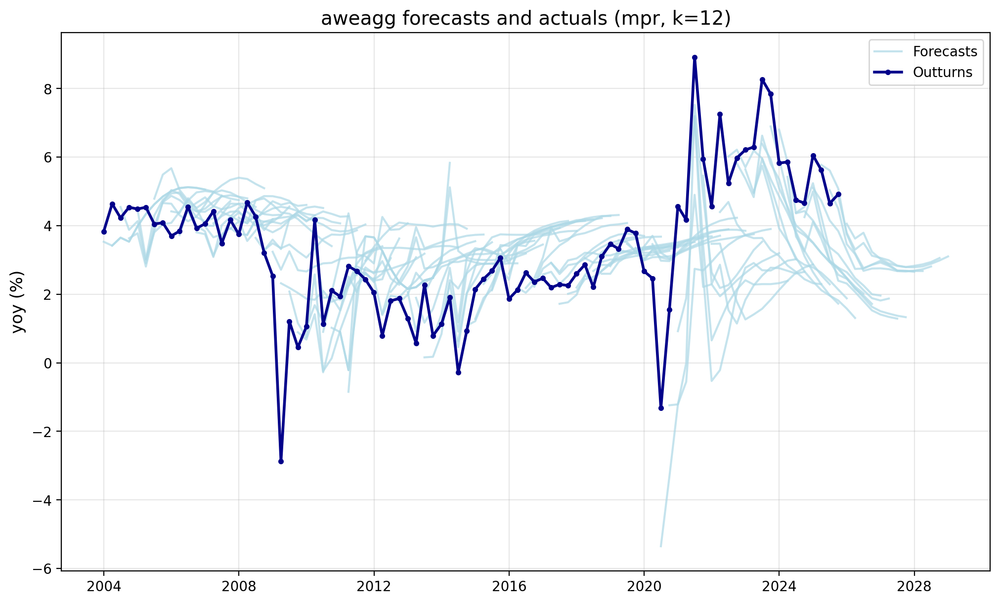
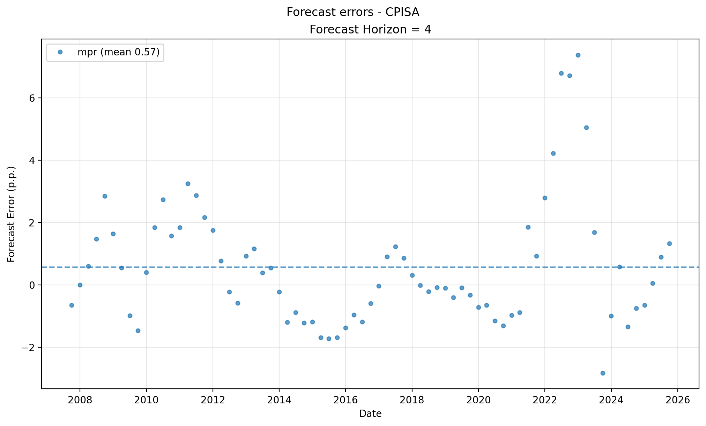
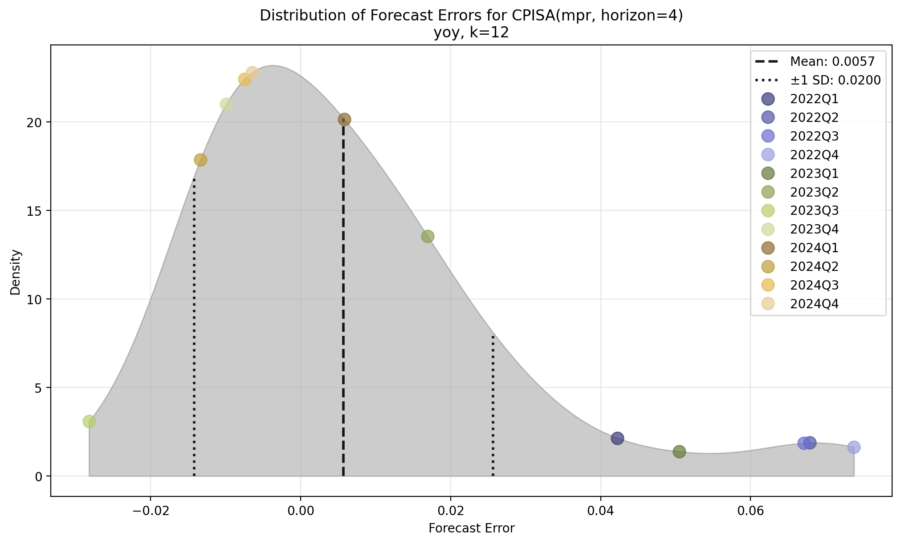
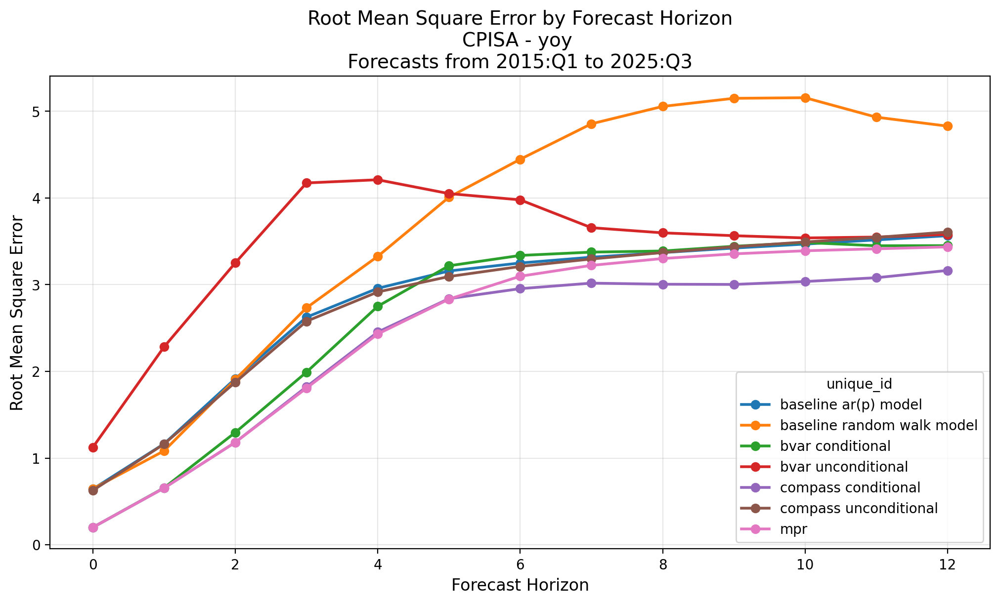
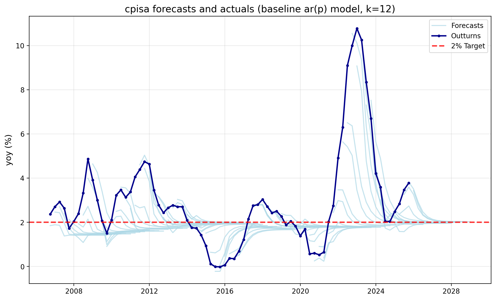
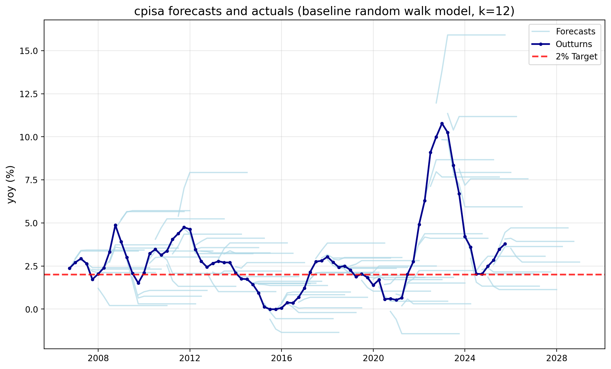
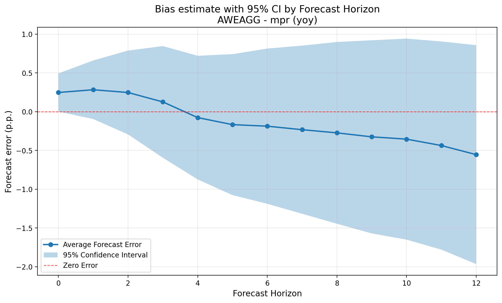
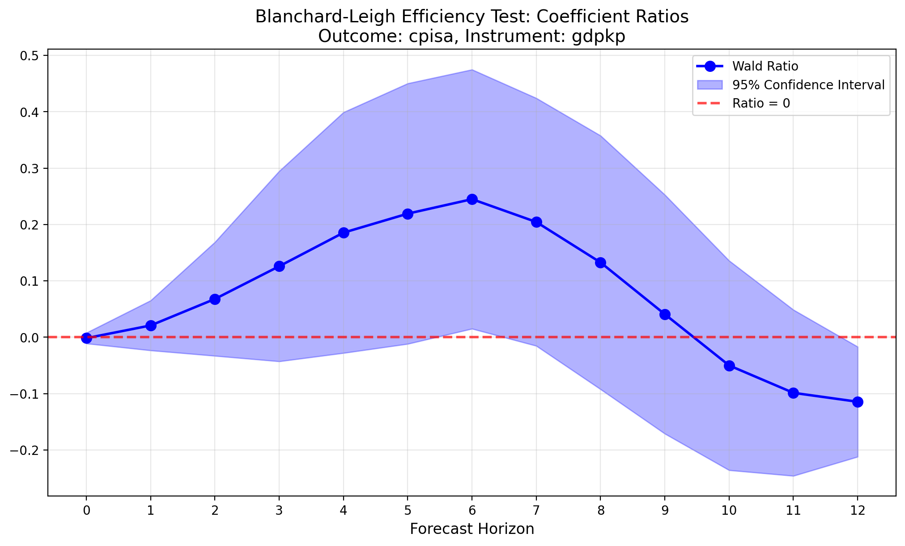
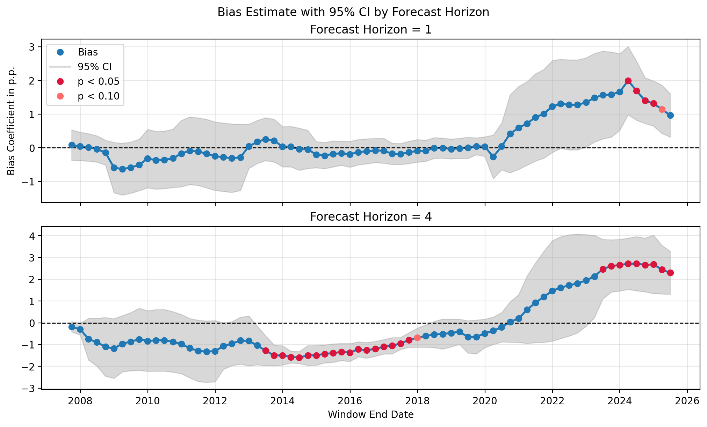

# Learning from Forecast Errors
## The Bank's Enhanced Approach to Forecast Evaluation
 

### Macro Modelling for Monetary Policy Forum, Leeds
 

**Paul Labonne**, Bank of England

 

**Paper:** Abiry, Hurley, Labonne, Latto, Li, Moreira, Oyegoke & Singh (2026)
[Macro Technical Paper No. 6](https://www.bankofengland.co.uk/macro-technical-paper/2026/learning-from-forecast-errors-the-banks-enhanced-approach-to-forecast-evaluation)

**Toolkit:** [github.com/bank-of-england/forecast_evaluation](https://github.com/bank-of-england/forecast_evaluation)

---
## Challenges to evaluating macroeconomic forecasts

| Challenge | Our approach |
|-----------|-------------|
| Regular and material revisions | Real-time vintages |
| Changing environment | Rolling window with fluctuation tests |
| Small samples | Statistical corrections |
| Statistical methods *identify* that something is wrong, not *why* | Counterfactuals, model-based decompositions |

> "Staff should be charged with highlighting *significant* forecast errors and their *sources*... Models and model components that may have contributed to forecast misses should be regularly evaluated."
> — Bernanke (2024), Recommendation 5
---

## Three dimensions of forecast quality
 

| Dimension | Question | Key methods |
|-----------|----------|-------------|
| **Accuracy** | How close are forecasts to outcomes? | RMSE, MAE, Diebold-Mariano |
| **Bias** | Do forecasts systematically over- or under-predict? | Mean error test, Mincer-Zarnowitz |
| **Efficiency** | Is all available information used optimally? | Nordhaus (weak), Blanchard-Leigh (strong) |

These are **complementary** — a forecast can be accurate on average but still biased or inefficient.

---

## The forecast error

The $h$-quarter-ahead error for variable $y$:
$$\varepsilon(y;k)_{t|t-h} := y_{t|t+1+k} - \hat{y}_{t|t-h}$$

where the outturn vintage $k$ controls which data release is used as the "truth".
We often set $k=12$ (~3 years after the reference quarter).

**Serial correlation at horizons $h > 1$**: even under an optimal forecast, $h$-step-ahead errors follow an MA$(h-1)$ process.

Standard errors in tests must therefore be HAC-robust (e.g. Newey-West with at least $h-1$ lags).

---

## Some sniff tests

*Are there obvious patterns or outliers worth investigating?*

- **Hedgehog chart**: overlay all forecast vintages against outturns — reveals persistent over/under-shooting
- **Errors over time**: spot structural breaks, outlier episodes, trending errors
- **Error density**: put individual errors in the context of the full distribution — highlights how unusual recent episodes are

---

## Some sniff tests

  

---

## Accuracy: how large are the errors?

*How large are the forecast errors, and do they grow with the horizon?*

$$\text{RMSE}_h = \sqrt{\frac{1}{N}\sum \varepsilon_{i,h}^2} \qquad \text{MAE}_h = \frac{1}{N}\sum |\varepsilon_{i,h}|$$

Both should monotonically grow with horizon.

- **RMSE** penalises large errors more; sensitive to outliers
- **MAE** treats all errors equally; more robust to outliers

---

## Accuracy: how large are the errors?

---

## Benchmark models

*What is a meaningful reference point for comparison?*

A **reference point** estimated with real-time vintages.

**Random Walk:** $\hat{y}_{t+h|t} = y_t$

**AR($p$):** $y_t = \mu + \sum_{i=1}^{p} \phi_i y_{t-i} + \varepsilon_t, \quad \varepsilon_t \sim t(\nu, 0, \sigma)$

- Lag order $p \leq 2$ selected by BIC; stationarity enforced
- **Student-$t$ errors** — heavy tails prevent large shocks (2008, 2020) from distorting estimation

---

## Benchmark models

 

---

## Relative accuracy: beating the benchmark

*Does the model significantly outperform a naive benchmark?*

$$\text{RMSE ratio}_h = \frac{\text{RMSE}^{\text{model}}_h}{\text{RMSE}^{\text{benchmark}}_h} \quad \begin{cases} < 1 & \text{model wins} \\ > 1 & \text{benchmark wins} \end{cases}$$

The **Diebold-Mariano test** asks if the difference is *significant*.
Define $d_t = \varepsilon^{A\,2}_{t,h} - \varepsilon^{B\,2}_{t,h}$ and test $H_0: \mathbb{E}[d_t] = 0$ with HAC standard errors. We follow Harvey et al. (2017) and Harvey et al. (1997) for the variance estimator and small-sample correction.

---

## Bias: mean error test

*Do forecasts systematically over- or under-predict?*

$$\varepsilon_{t,h} = \beta + u_t, \quad H_0: \beta = 0$$

$\hat\beta > 0$: forecasts **underestimate** outturns; $\hat\beta < 0$: **overestimate**.
OLS with HAC standard errors (max lag $= h$).

**Mincer-Zarnowitz** — joint test of no level or slope bias:
$$y_{t+h} = \beta_0 + \beta_1 \hat{y}_{t+h|t} + u_{t+h}, \quad H_0: \beta_0=0,\ \beta_1=1$$

---

## Bias: mean error test

---

## Efficiency: weak vs strong

*Was all available information used optimally when making the forecast?*

**Weak efficiency** — did the forecaster use their *own past forecasts*?
If today's revision is predictable from last quarter's, information was incorporated too slowly.
*Clean identification*: the forecaster certainly had their own past numbers.

**Strong efficiency** — did the forecaster use *all available information*?
If errors in $y$ are predictable from anything the forecaster knew, the forecast is inefficient.
*Harder to test*: requires knowing what was in the forecaster's information set.

**Blanchard-Leigh** bridges the two: it uses the forecaster's *own forecast* of another variable $x$. Since they produced $\hat{x}$ themselves, they certainly had it — so it inherits the clean identification of weak efficiency while testing whether the *pass-through* from $x$ to $y$ was correctly specified.

---

## Efficiency: weak (Nordhaus 1987)

*Were past forecasts fully incorporated — or was information smoothed in gradually?*

A forecast is **weakly efficient** if past revisions cannot predict future revisions.

$$R(y)_{t|t} = \alpha + \sum_{i=1}^{N} \beta_i R(y)_{t|t-i} + u_t, \quad H_0: \beta_1 = \cdots = \beta_N = 0$$

Rejection signals **information smoothing**: news incorporated gradually.

---

## Efficiency: strong — the original Blanchard-Leigh (2013)

*Were cross-variable pass-throughs correctly specified?*

$$\varepsilon(y)_{t+h|t} = \alpha + \beta\hat{x}_{t+j|t} + u$$

Suppose the forecaster thinks *"1pp more GDP growth → 0.3pp more inflation"*, but the true pass-through is 0.5pp. Then every time they forecast strong GDP, they'll underpredict inflation. Their inflation errors will be systematically correlated with their own GDP forecast.

$\beta > 0$: pass-through underestimated; $\beta < 0$: overestimated; $\beta = 0$: efficient.

---

## Efficiency: strong — Kanngiesser and Willems (2024)

*How large is the pass-through misspecification, correcting for the quality of the instrument forecast?*

The original was a single equation. Kanngiesser and Willems (2024) extend it with a **Wald ratio** $\omega = \beta/\delta$ that corrects for systematic errors in the instrument forecasts:

$$\varepsilon(y)_{t+h|t} = \alpha + \beta\hat{x}_{t+j|t} + u \qquad x_{t+j} = \gamma + \delta\hat{x}_{t+j|t} + e$$

**Equation 1**: do my forecasts of $x$ predict my errors in $y$? ($\beta \neq 0$ → problem)

**Equation 2**: how informative is my forecast of $x$ about actual $x$? (scaling correction)

$\omega = \beta/\delta$ isolates the pure pass-through misspecification: *for every 1pp of actual $x$ movement, how many pp did I get wrong about $y$?*

$\omega > 0$: pass-through underestimated; $\omega < 0$: overestimated; $\omega = 0$: efficient.

---

## Efficiency: strong (Blanchard-Leigh)

---

## Unstable environments: the stationarity problem

All previous tests require that the *object of interest* (mean, error difference, etc) is *covariance-stationary* — its mean and autocovariance do not change over time.

In practice this often fails:

- **Structural breaks** — policy regime changes, financial crises, pandemics shift the distribution
- **Evolving models** — forecasting frameworks are updated, changing error dynamics
- **Time-varying volatility** — the Great Moderation, post-COVID inflation

---

## Unstable environments: rolling and fluctuation tests

*When did a weakness emerge or disappear?*

**Rolling window** ($W$ observations): re-run the test on every consecutive sub-sample. Reveals *when* a problem emerged or disappeared.

**Fluctuation test** (Giacomini & Rossi, 2010): same rolling window, but with critical values adjusted for the multiple-testing nature of scanning across windows. The null is that the test is never rejected in any window.

---

## Unstable environments: rolling window with fluctuation tests

---

## Beyond statistical signals: establishing causes

*What drove the error — bad luck, bad assumptions, or a misspecified model?*

**Counterfactual forecasts** (COMPASS-based)
- What would the forecast have been with perfect foresight of conditioning paths?
- Separates *input surprises* (energy, Bank Rate, exchange rate) from *model errors*
- Aug 2021 MPR: conditioning path news explains >2/3 of the CPI miss (+5.7pp of 8.2pp peak)

**Model-based decompositions**
- COMPASS historical decomposition: demand vs supply vs energy vs monetary contributions
- SVAR (Brignone & Piffer 2025): probabilistic shock identification using forecast errors
- Cross-model comparison surfaces potential misspecification — e.g. role of demand in post-Covid inflation
---

## The Python toolkit

Open source: [github.com/bank-of-england/forecast_evaluation](https://github.com/bank-of-england/forecast_evaluation)

#### Having a Python package internally helps with:
- Reducing duplication
- Maintenance

#### Releasing externally helps with:
- Improving transparency
- Fostering external engagement
- Leveraging external contributors

#### Next:
- Density forecasts
- More tests and visualisations
